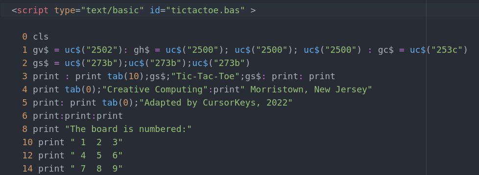

# B3Script

Plugin for embedding "Basic" as a scripting language into HTML

---

B3Script stands for Basic Script for WWW (W3) 

Or if you prefer Blazing Browser Basic :)

Short: B3

---

To read more about this project, check [the Wiki](https://github.com/JoystickAndCursorKeys/B3Script/wiki) for more information

To download click [Download the library](https://github.com/JoystickAndCursorKeys/B3Script/wiki/Download)

Go here to [Run the example directly](https://joystickandcursorkeys.github.io/B3Script/testit/)

To read [The source code](https://github.com/JoystickAndCursorKeys/B3ScriptSource), click me!
